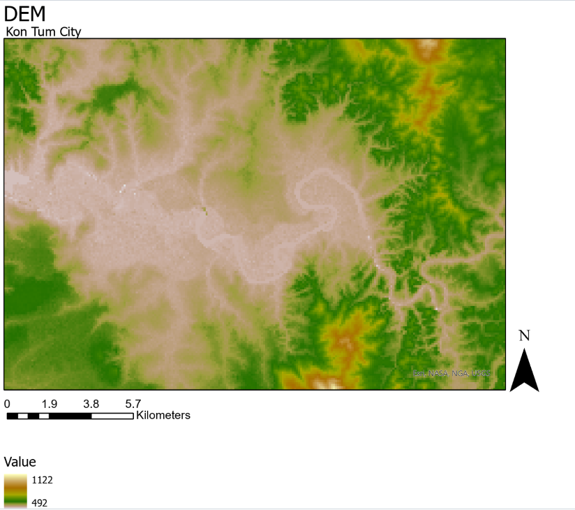
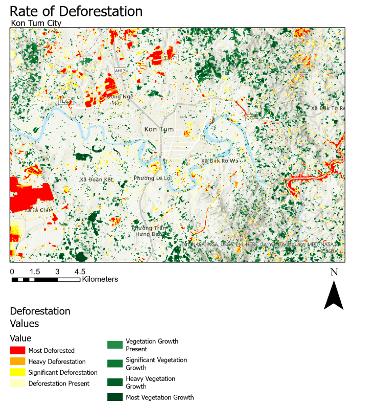

 
## About Me

 

Hello, my name is Holden Ford and I am 24 years old. 

I enjoy being outdoors a lot, especially in the context of camping or hiking. I love to learn new things about the world around me.

I love writing and drawing. I like Lord of the Rings and Star Trek and can talk endlessly about them. I play DnD in my spare time with my friends.

## Education

I attended Orange Coast College for my associates in Natural Science and to prepare me for a transfer to a full university.
This is where I really fell in love with geology. 

Afterwards, I transferred to California State University, Long Beach (CSULB) to pursue a degree in geology. 

Finally, I am currently in the MS program from Geographic Information Science. I am excited to put these skills to use in geology. '

One day, I hope to be able to pursue my doctorate in geology. 

## Career

My career is only just beginning! I am fresh on the scene from graduation and eager to be employed full time. 

In the past I have worked several jobs across all different types. I have worked service jobs, research jobs and most recently within education.

My ultimate goal in life is to be a park ranger. I enjoy teaching people about the outdoors almost as much as I enjoy being in them.

A full CV can be [found here.](https://github.com/Holden-F/portfolio/blob/7a8f5c5c0f95f000e1d83510942aed4d94f67483/Ford%20Resume%202023.pdf)

## Work Samples

| |
|:--:|
|[DEM of Vietnamese City of Kon Tum.](DEM_FINAL.pdf) |
| *A DEM of the Vietnamese City, Kon Tum. Specifically it was created to highlight River meanders.* |

| |
|:--:|
| [Deforestation in Vietnam.](Deforestation2.pdf) |
| *A map of deforestation in Vietnam around Kon Tum City. It was generated using NDVI.* |

#### Contact Me:

Phone: [1-(714)-595-3445](tel:17145953445)

Emails: 
1. [rmford100@gmail.com](mailto:rmford100@gmail.com)
1. [rholdenford@gmail.com](mailto:rholdenford@gmail.com)
1. [holden.ford@student.csulb.edu](mailto:holden.ford@student.csulb.edu)

Linkedin: [rachel-holden-ford](https://www.linkedin.com/in/rachel-holden-ford/)

Instagram: [rholdenford](https://www.instagram.com/rholdenford/)

github: [holden-f](https://github.com/Holden-F)

----

[Just the Docs]: https://just-the-docs.github.io/just-the-docs/
[GitHub Pages]: https://docs.github.com/en/pages
[README]: https://github.com/just-the-docs/just-the-docs-template/blob/main/README.md
[Jekyll]: https://jekyllrb.com
[GitHub Pages / Actions workflow]: https://github.blog/changelog/2022-07-27-github-pages-custom-github-actions-workflows-beta/
[use this template]: https://github.com/just-the-docs/just-the-docs-template/generate
